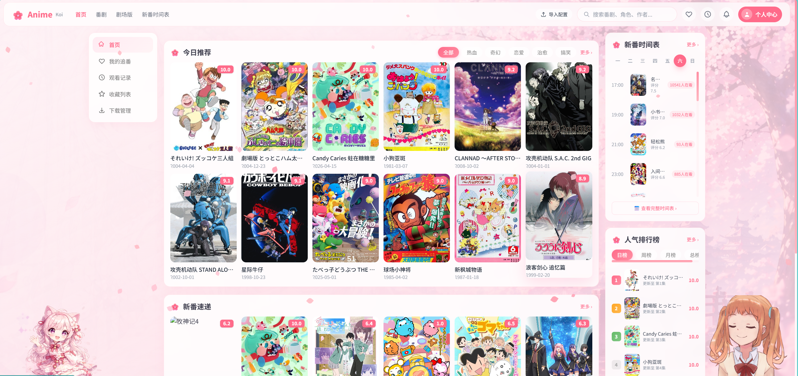
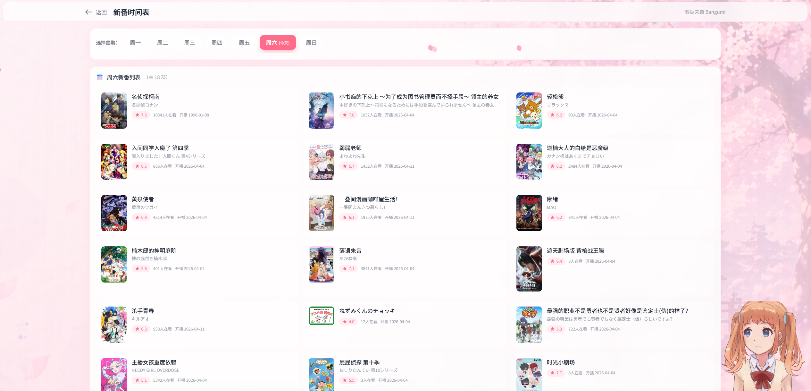
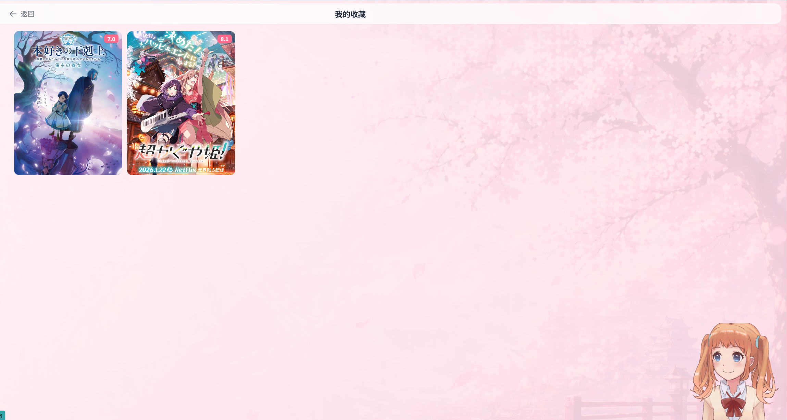
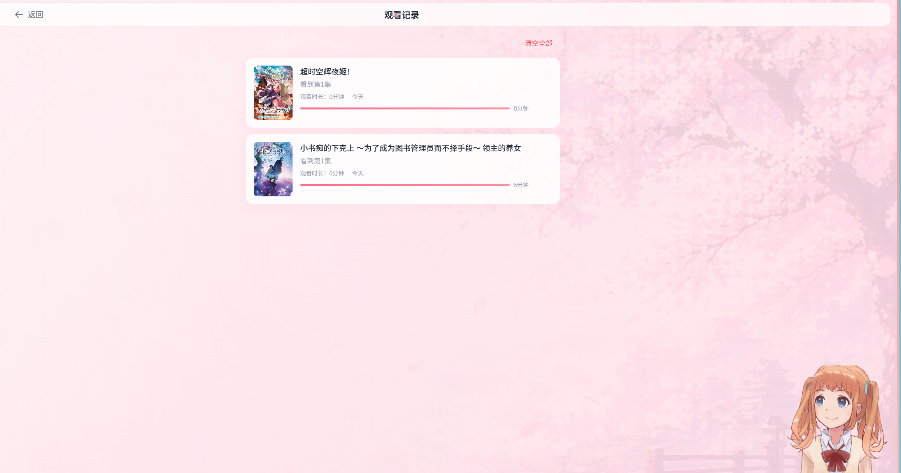
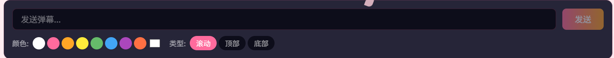
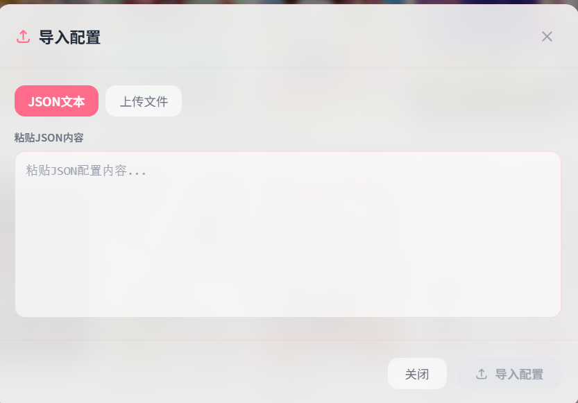

# cbAnime - 动漫资源聚合平台网页端

cbAnime 是一个功能丰富的动漫资源聚合平台，提供动漫搜索、在线观看、弹幕互动、收藏管理等一站式服务。平台集成多数据源，支持新番时间表、用户自定义资源配置等功能。

## ✨ 核心特性

### 🎬 视频播放
- 支持 HLS 流媒体播放
- 集成实时弹幕系统，支持弹幕发送、屏蔽、右键交互
- 自定义视频播放器UI，支持全屏、倍速播放等功能

### 🔍 多数据源搜索
- 聚合多个数据源的动漫资源
- 支持关键词搜索、分类筛选
- 展示搜索结果对比，方便用户选择最佳资源

### 📅 新番时间表
- 每周新番更新日程一览
- 按星期分类展示
- 快速定位感兴趣的新番

### 💜 用户系统
- 用户注册、登录与权限管理
- 个人收藏管理
- 观看历史记录
- 个人资料设置

### 🎨 界面体验
- 樱花主题视觉设计，支持樱花飘落动画
- Live2D 虚拟角色 Widget，增强互动体验
- 响应式布局，适配多种屏幕尺寸
- 首页轮播Banner展示推荐内容

### 🔧 管理后台
- 管理员专属控制面板
- 用户反馈管理与状态跟踪
- 首页推荐位配置（轮播、热门、新番）
- 数据统计仪表盘

## 🛠️ 技术栈

| 类别 | 技术 |
|------|------|
| 前端框架 | React 18 + TypeScript |
| 构建工具 | Vite 5 |
| 路由 | React Router v6 |
| 样式 | Tailwind CSS + PostCSS |
| 视频播放 | HLS.js |
| 弹幕系统 | Canvas 自渲染弹幕引擎 |
| HTTP 请求 | Axios |
| 虚拟形象 | Live2D Widget |

## 📦 快速开始

### 环境要求
- Node.js >= 18.0
- npm >= 9.0

### 安装依赖
```bash
npm install
```

### 启动开发服务器
```bash
npm run dev
```

### 构建生产版本
```bash
npm run build
```

### 预览生产构建
```bash
npm run preview
```

## 📁 项目结构

```
src/
├── api/                    # API 接口层
│   ├── admin.ts            # 管理后台相关接口
│   ├── anime.ts            # 动漫资源相关接口
│   ├── auth.ts             # 用户认证接口
│   └── index.ts
├── components/             # 可复用组件
│   ├── AnimeCard.tsx       # 动漫卡片组件
│   ├── BannerCarousel.tsx  # 首页轮播组件
│   ├── DanmakuInput.tsx    # 弹幕输入组件
│   ├── DanmakuPlayer.tsx   # Canvas 弹幕播放器
│   ├── VideoPlayer.tsx     # 视频播放器
│   ├── Live2DWidget.tsx    # Live2D 虚拟形象
│   ├── SakuraPetals.tsx    # 樱花飘落动画
│   └── ...
├── pages/                  # 页面组件
│   ├── home/               # 首页
│   ├── anime/              # 动漫列表与详情
│   ├── search/             # 搜索页面
│   ├── schedule/           # 新番时间表
│   ├── profile/            # 用户中心（收藏、历史）
│   ├── auth/               # 登录注册
│   └── admin/              # 管理后台
├── types/                  # TypeScript 类型定义
├── utils/                  # 工具函数
│   ├── api.ts              # API 工具封装
│   └── authStorage.ts      # 认证状态管理
├── router.tsx              # 路由配置
├── main.tsx                # 应用入口
└── index.css               # 全局样式
```

## 📸 屏幕截图

### 首页


### 新番时间表


### 收藏与观看记录



### 多数据源搜索


### 弹幕服务


### 用户自定义资源配置


## 🔗 相关文档

- [管理员后台使用指南](ADMIN_README.md)
- [用户模块接口文档](接口文档/user模块接口文档.md)
- [动漫元数据接口文档](接口文档/动漫元数据.md)
- [弹幕接口文档](接口文档/弹幕接口文档.md)

## 🚀 未来规划

- [ ] 集成 AI Agent，实现智能动漫推荐与交互
- [ ] 支持离线缓存下载
- [ ] 弹幕高级玩法（彩色弹幕、高级弹幕特效）
- [ ] 社交功能（评论、评分、分享）
- [ ] 移动端 PWA 支持
- [ ] 多语言国际化

## 📝 开发说明

### 添加新页面
1. 在 `src/pages/` 下创建页面组件
2. 在 `src/router.tsx` 中添加路由配置
3. 如需调用接口，在 `src/api/` 中添加对应方法

### 添加新组件
1. 在 `src/components/` 下创建组件
2. 遵循现有命名规范（PascalCase）
3. 使用 TypeScript 定义 Props 类型

## 📄 开源协议

本项目仅供学习交流使用。
